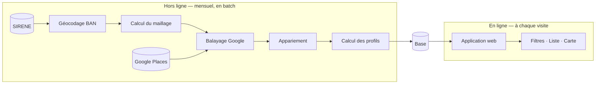

# Architecture

> **Statut** : acté · **Dernière mise à jour** : 2026-08-28

## Deux moitiés indépendantes

Le système se sépare nettement en deux, et cette séparation est la principale décision
d'architecture.

**Hors ligne** — une chaîne de scripts, exécutée une fois par mois, qui construit la base :
récupération des sources, appariement, calcul des profils d'horaires. C'est là que se
trouvent toute la complexité et tout le coût.

**En ligne** — une application web qui ne fait que **lire** cette base et la présenter. Elle
n'appelle aucune API externe, ne calcule rien, ne déduit rien. Une requête filtrée sur une
table, et c'est tout.

### Pourquoi cette séparation

- **Le coût est borné et prévisible.** L'application peut être consultée mille fois par jour
  sans consommer un seul appel Google : tout est déjà en base.
- **Les règles de déduction se corrigent gratuitement.** Le calcul des profils ne fait aucun
  appel réseau : on peut réajuster le seuil de coupure ou les règles d'inférence et tout
  recalculer sans redépenser un centime.
- **L'application reste triviale.** Pas de cache applicatif, pas de gestion d'erreur d'API
  tierce, pas de latence externe. Un formulaire, une requête SQL, une carte.
- **Une panne d'ingestion ne casse rien.** Si le balayage mensuel échoue, l'application
  continue de servir les données du mois précédent.

## Le flux de données

| Étape | Entrée | Sortie | Coût |
|---|---|---|---|
| Registre | SIRENE | Liste des établissements + effectifs | Gratuit |
| Géocodage | Adresses SIRENE | Coordonnées | Gratuit |
| Maillage | Densité géographique | Plan de balayage | Gratuit |
| Balayage | Plan de balayage | Établissements + horaires Google | ~400 appels |
| Appariement | Google + SIRENE | Établissements enrichis de leur effectif | Gratuit |
| Profils | Horaires brutes + effectif | Profil de rythme filtrable | Gratuit |

Voir [`06-pipeline-ingestion.md`](06-pipeline-ingestion.md) pour le détail des scripts.

## Principes structurants

**La source de données est isolée derrière une interface.** Google Places est un choix, pas
une fatalité : si les tarifs ou les conditions changent, OpenStreetMap reste un plan B
gratuit et redistribuable. Aucune structure de données Google ne doit fuiter au-delà de la
couche d'ingestion.

**Le profil de rythme est dénormalisé.** Ce qu'on filtre — sans coupure, fermé le week-end,
deux jours de repos d'affilée — est stocké en colonnes prêtes à l'emploi, calculées une fois
en batch. Aucune déduction ne se fait au moment de la requête.

**Les horaires brutes sont conservées telles quelles.** On garde la réponse Google d'origine
à côté du profil calculé, pour pouvoir tout recalculer si les règles évoluent, et pour
afficher la grille horaire de la semaine.

**Tout script coûteux est idempotent et rejouable.** Une exécution interrompue se reprend
sans dégât et sans double facturation.
