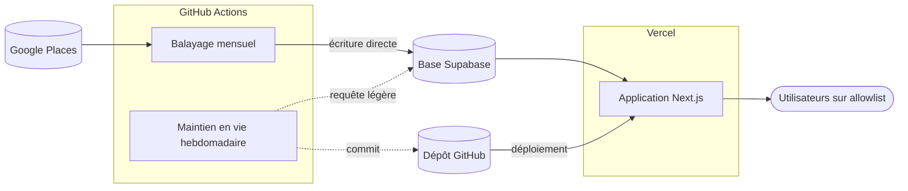

# Déploiement

> **Statut** : acté · **Dernière mise à jour** : 2026-08-28

L'outil doit tourner **sur le web, gratuitement, pour deux ou trois personnes**. Cette spec
dit où tourne quoi, comment le résultat du balayage atteint la production, et surtout ce qui
éteindrait l'outil tout seul si personne n'y prenait garde.

[`08-infrastructure.md`](08-infrastructure.md) décrit les comptes et les clés. Celle-ci
décrit ce qui s'exécute, où, et quand.

---

## Topologie

| Quoi | Où | Quand | Déclencheur |
|---|---|---|---|
| Application web | Vercel Hobby | À chaque visite | Requête d'un utilisateur |
| Base + authentification | Supabase, région Europe | En continu | — |
| Balayage mensuel | GitHub Actions | 1er du mois, 03:00 UTC | Planification + manuel |
| Maintien en vie | GitHub Actions | Chaque lundi | Planification + manuel |
| Ingestion SIRENE et géocodage | Poste local | Trimestriel | À la main |

**Le balayage ne tourne pas sur Vercel**, et ce n'est pas un détail de commodité. Une
fonction Hobby est plafonnée en durée, et la planification Hobby ne descend pas sous la
journée : 692 appels enchaînés n'y tiennent pas. Surtout, faire tourner le balayage dans
l'application y ferait entrer la clé Places — celle qui donne accès au palier facturé — dans
l'environnement qui sert du trafic. Elle reste dans un environnement qui n'en sert jamais.

L'ingestion SIRENE et le géocodage restent sur le poste local : 830 Mo de Parquet à filtrer
pour un travail fait une fois par trimestre, cela n'a rien à faire dans une tâche planifiée.

### Pourquoi cette séparation rend le coût prévisible

C'est la traduction en infrastructure de la décision d'architecture
([`00-architecture.md`](00-architecture.md)) : l'application ne fait **aucun** appel Google,
elle lit une base déjà remplie.

Conséquence directe : **le coût est adossé au nombre de balayages, jamais au nombre de
visites.** Dix visiteurs ou dix mille, la facture Google est identique. Un outil qui
interrogerait Google à chaque recherche aurait un coût proportionnel à son succès — ici, le
succès est gratuit.

Et comme le seul poste coûteux s'exécute à un seul endroit, sur une planification unique et
sous un plafond de quota posé chez Google, le montant à dépenser est **connu avant d'être
engagé** : 692 appels, une fois par mois, sur 1 000 gratuits.

---

## Comment le résultat du balayage arrive en production

C'est la question qui revient toujours : *faut-il téléverser le résultat quelque part ?*

**Oui — et c'est l'écriture en base qui joue ce rôle.** Le balayage s'exécute dans GitHub
Actions et écrit **directement dans la base Supabase de production**. Il n'y a pas
d'artefact à récupérer, pas d'export à recopier, pas d'étape de publication : la tâche
planifiée détient l'URL de connexion à la base de production en secret de dépôt, et la
remplit elle-même.

Le job ne se limite pas à l'appel Google : il enchaîne le maillage, le balayage,
l'appariement SIRENE et le calcul des profils — la chaîne 3→6 de
[`06-pipeline-ingestion.md`](06-pipeline-ingestion.md). Ce qui atterrit en base, ce sont donc
des **profils prêts à être filtrés**, pas des horaires brutes : l'application n'a rien à
recalculer au moment de la visite.

C'est aussi le seul endroit du dépôt où le `--dry-run` posé par défaut sur tout script
consommant du quota est explicitement levé. Cette levée est une décision, elle est écrite à
un seul endroit, et elle se relit.

Trois conséquences qu'il faut avoir en tête :

- **Aucun redéploiement n'est nécessaire après un balayage.** L'application lit la base à
  chaque visite ; les nouvelles horaires sont visibles dès la fin du job. Le dépôt n'a pas
  bougé, donc Vercel ne rebâtit rien.
- **GitHub Actions est le seul endroit hors application qui écrit dans la base de
  production.** C'est aussi pour cela que le job doit échouer bruyamment : personne ne
  relit son résultat.
- **Un balayage raté ne casse pas la production.** La base garde les données du mois
  précédent, l'application continue de servir. Ce qui se dégrade, c'est l'âge de la donnée,
  et cela se voit — pas un écran d'erreur.

### Pourquoi on ne peut pas embarquer un instantané des données dans le dépôt

La tentation est réelle, et l'idée serait plus simple : commiter un export des
établissements, laisser Vercel le lire au moment du build, et se passer à la fois du secret
de base dans Actions et de la base à maintenir éveillée.

**C'est impossible ici, pour une raison qui n'est pas technique.** Les conditions
d'utilisation de Google limitent la conservation du contenu Places à **30 jours** (D7). Or
**l'historique git conserve indéfiniment** : un instantané commité aujourd'hui reste lisible
dans cinq ans, y compris s'il est retiré du dernier commit. L'effacer réellement demanderait
de réécrire l'historique et de forcer la réécriture chez tous ceux qui l'ont cloné. Le dépôt
étant **public**, ce serait de surcroît une redistribution publique de contenu Google.

La base, elle, se **remplace** : chaque balayage écrase les horaires du mois précédent, et la
donnée n'a jamais plus de 30 jours. La conformité est obtenue par construction et non par une
purge qu'il faudrait penser à appliquer — c'est exactement ce qu'acte D7, et un instantané
dans git l'annulerait.

Seul l'identifiant de lieu Google est stockable sans limite de durée. Il ne permet pas, à lui
seul, de reconstituer un annuaire.

> Le même raisonnement interdit d'archiver la réponse brute du balayage en artefact de build,
> en pièce jointe d'exécution ou dans un espace de stockage de secours : ce n'est pas le
> support qui pose problème, c'est la durée.

---

## Les deux comptes à rebours

Les offres gratuites ne se contentent pas de plafonner : elles **éteignent ce qui ne sert
pas**. Deux mécanismes distincts s'appliquent ici, et pour un outil consulté par deux
personnes de façon sporadique, **les deux se déclencheraient**.

| Mécanisme | Délai | Ce qui se passe | Ce qui remet le compteur à zéro |
|---|---|---|---|
| Mise en pause Supabase | 7 jours sans activité sur la base | Projet en pause : l'application ne répond plus. Une pause prolongée finit par la **suppression** du projet | Toute activité sur la base |
| Désactivation de la planification GitHub | 60 jours sans activité **sur le dépôt** | Le balayage mensuel cesse de se déclencher | Un **commit** |

Le premier se déclenche en une semaine de vacances. Le second en deux mois sans commit — ce
qui, sur un projet personnel arrivé à maturité, est une durée ordinaire.

**Le piège du second est qu'il est contre-intuitif** : une exécution de workflow **ne compte
pas** comme activité du dépôt. Seul un commit compte. Le balayage mensuel ne se maintient
donc pas lui-même — il se coupe l'herbe sous le pied, silencieusement, au bout du deuxième
mois.

### Un seul remède pour les deux

Un workflow hebdomadaire qui fait deux gestes :

1. une **requête légère sur la base** — c'est la connexion qui compte comme activité, pas ce
   qu'on lit ;
2. un **commit d'horodatage** dans un fichier dédié — c'est le commit qui compte, pas son
   contenu.

Un seul mécanisme, deux pannes évitées. La fréquence hebdomadaire est dictée par le plus
court des deux délais : elle laisse deux tentatives avant les 7 jours de Supabase.

> Le balayage mensuel réveille lui aussi la base, mais une fois par mois — c'est plus long
> que 7 jours. Il ne remplace pas la requête hebdomadaire.

**Ce workflow n'a aucun effet visible : c'est exactement ce qui le rend fragile.** La
prochaine personne qui fera le ménage le prendra pour un résidu et le supprimera — l'outil
s'éteindra alors avec un mois de délai, sans rien signaler. D'où deux précautions : son
en-tête explique les deux compteurs en toutes lettres, et le fichier d'horodatage qu'il
produit renvoie lui-même à cet en-tête.

Le commit est poussé sous l'identité du robot GitHub. Un push authentifié de cette manière ne
redéclenche aucun workflow : pas de boucle, et pas de redéploiement Vercel hebdomadaire
inutile.

---

## Les limites des offres gratuites, et ce qui se passe quand on les atteint

| Service | Limite | Ce qui se passe si on l'atteint | Coût |
|---|---|---|---|
| **Google Places** | 1 000 appels Enterprise par mois | **C'est facturé**, dès le premier appel au-delà. Il n'y a aucun crédit de secours sur ce compte | Le seul poste à risque |
| **Google Places** | Plafond journalier posé à la main : 800 | `HTTP 429`, l'appel échoue | 0 € — c'est un mur, pas un seuil |
| **Supabase** | 500 Mo de base | Écritures refusées | 0 € — quelques dizaines de Mo suffisent ici |
| **Supabase** | Pause après 7 jours d'inactivité | L'application ne répond plus ; réveil depuis le tableau de bord | 0 € |
| **Vercel Hobby** | 100 Go de bande passante par mois | Déploiements suspendus jusqu'au mois suivant | 0 € — hors d'atteinte à cette échelle |
| **Vercel Hobby** | Usage strictement non commercial | Suspension du compte | Sans objet tant que l'accès reste sur liste fermée (D11) |
| **GitHub Actions** | Minutes illimitées sur dépôt public | — | 0 € |

**Une seule de ces lignes coûte de l'argent**, et il faut être précis sur ce qui la protège :

- Le plafond journalier de 800 appels borne un **emballement à l'intérieur d'une exécution** :
  une boucle accidentelle échoue au lieu de facturer.
- Ce qui borne le **total mensuel**, c'est autre chose : le balayage n'est planifié qu'une
  fois par mois, et le script refuse de rejouer un balayage réussi depuis moins de 25 jours.
  Un déclenchement manuel de trop ne dépense donc rien.

Les deux protections sont nécessaires. Le plafond journalier seul autoriserait 24 000 appels
sur un mois ; la règle des 25 jours seule ne protégerait pas d'une boucle.

Voir [`02-budget-google-et-garde-fous.md`](02-budget-google-et-garde-fous.md) pour le modèle
tarifaire complet.

---

## Ce qu'il reste à faire, dans l'ordre

Actions manuelles, hors du dépôt. Le repère ⚠️ signale ce qui protège du coût ou de la perte
de données.

> **Prérequis** : les scripts d'ingestion décrits en
> [`06-pipeline-ingestion.md`](06-pipeline-ingestion.md) doivent être écrits et validés en
> local. La mise en production les exécute, elle ne les remplace pas.

### Supabase
1. Créer le projet, **région Europe**, activer l'extension `pg_trgm`
2. Authentification : lien par email, **inscription désactivée** (D14)
3. Appliquer le schéma à la base de production — **avant** tout balayage, sinon le premier
   job échoue sur des tables absentes
4. Relever les URL de connexion. ⚠️ **Attention au mode de connexion** : sur l'offre
   gratuite, la connexion directe n'est joignable qu'en IPv6, dont les runners GitHub ne
   disposent pas. Le balayage doit donc passer par le connecteur mutualisé, en mode
   **session** — le mode transaction convient à l'application, pas à un script batch qui
   ouvre une connexion longue

### GitHub
5. ⚠️ Configurer l'identité git du dépôt sur l'adresse `noreply`, **avant le premier push** —
   après, l'adresse est publique et définitive
6. ⚠️ Activer la **protection au push** — sur un dépôt public, un secret commité par erreur
   est moissonné en quelques minutes
7. Créer les deux secrets de dépôt : clé Places et URL de la base **de production**
8. Vérifier que les workflows sont autorisés à écrire dans le dépôt — sans quoi le commit
   hebdomadaire de maintien en vie échouera

### Vercel
9. Importer le dépôt, renseigner les variables d'environnement de production
10. Une fois le domaine attribué : compléter la **restriction par référent** de la clé Maps
    et les URL de redirection Supabase. ⚠️ Tant que ce n'est pas fait, la clé Maps est
    utilisable par n'importe qui

### Mise en service
11. Déclencher **manuellement le maintien en vie** — il vérifie d'un coup le secret de base,
    la joignabilité de Supabase et le droit d'écriture sur le dépôt, sans dépenser un seul
    appel Google
12. ⚠️ Valider le coût en local avec `--dry-run` **pointé sur la base de production** : le
    plan doit annoncer de l'ordre de 692 appels. Au-delà de ~800, on retravaille le maillage
    avant de dépenser
13. Déclencher **manuellement le balayage**, et le regarder aller au bout
14. Passer les contrôles de fin de cycle de
    [`06-pipeline-ingestion.md`](06-pipeline-ingestion.md) — en particulier **cellules
    tronquées non résolues = 0**
15. ⚠️ Vérifier en console de facturation : consommation Enterprise proche de 692, et
    **rien sur le palier Atmosphere**
16. Créer les comptes des utilisateurs à la main — c'est l'allowlist (D14)

### Un mois plus tard
17. Vérifier que le balayage planifié s'est bien déclenché tout seul, et que les commits
    hebdomadaires de maintien en vie sont présents. C'est le seul moyen de savoir que les
    deux comptes à rebours sont bien neutralisés.
